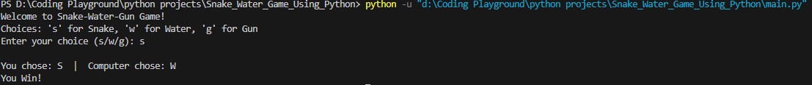

# Snake Water Gun Game 🎮🐍💧🔫

A lightweight, terminal-based Python game inspired by the classic **Snake-Water-Gun** challenge — a creative twist on Rock-Paper-Scissors. Perfect for Python beginners and enthusiasts looking to build interactive CLI-based games.

---

## 📜 Game Rules

Each player (you and the computer) selects one of the following options:

- 🐍 **Snake (`s`)** drinks the water → Snake defeats Water
- 💧 **Water (`w`)** damages the gun → Water defeats Gun
- 🔫 **Gun (`g`)** kills the snake → Gun defeats Snake

> If both choices are the same, the round is declared a **draw**.

---

## ⚙️ Encoding Reference

| Symbol | Choice | Value |
|--------|--------|--------|
| `s`    | Snake  | `1`    |
| `w`    | Water  | `-1`   |
| `g`    | Gun    | `0`    |

---

## ▶️ How to Play

1. Run the Python script in your terminal.
2. Enter your choice: `s`, `w`, or `g`.
3. The computer will randomly choose one as well.
4. The game will determine and display the winner!

---

## 📸 Preview



---

## 📥 Clone the Repository

To get a local copy up and running, execute the following command in your terminal:

```bash
git clone https://github.com/AbdullahJaveid/Snake_Water_Game_Using_Python.git
